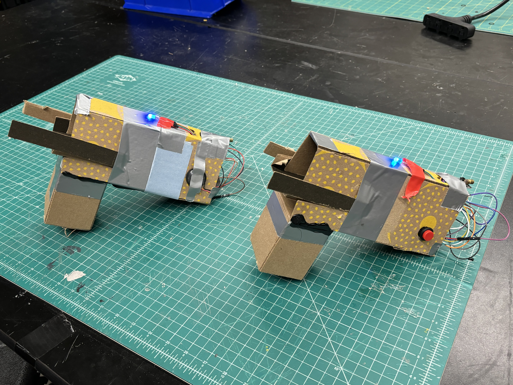

# RickGHomies-Laser-Tag

## Meet The Team

Ryan Irwandy
Rana Singh
Josh Lapidario
Sialoi Taa

## Overview
For the theme of Hard Hack 2024, we created a hardware-based Infrared (IR) tag game you can play with friends when "the party never stops".
Each player has a gun which acts as both IR emitter and an IR receiver, and they have 3 lives. Every time the other player shoots their gun,
an audio cue plays from the speaker indicating that a life has been lost.

## Components

### IR Emitter
The IR Emitter 

### IR Receiver
The IR Recejver

## Setup
Inside our *Iterations* section, we have our prototypes. In this section we'll dive into what thye compose of.
In out first prototype, we have a cardbord holster that would house an IR remote. This prototype was designed
to take emit an IR signal to an IR receiver where the other player would be.  

In the second iteration, we have a more complex version that houses

## Iterations
Here is the first prototype of the lazer tag gun.

Here is the second prototype of the lazer tag gun.

And the latest iteration is still in progress.
